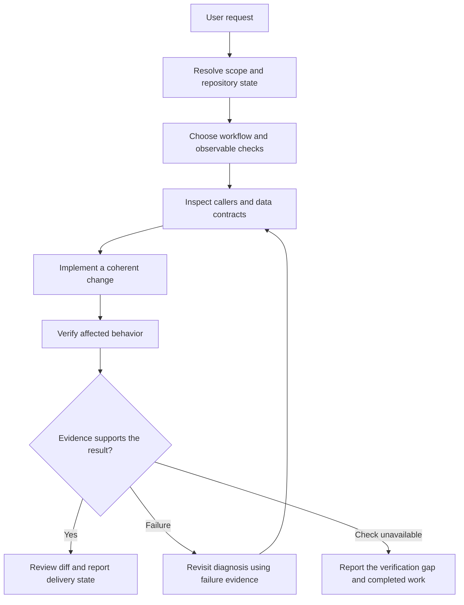

# Engineering Mode

[English](README.md) | [ภาษาไทย](README.th.md)

Engineering Mode guides an agent through scoped engineering work: understand the requested behavior, choose a suitable workflow, implement the change, and collect evidence for the result. It is an instruction-based skill, not an executable framework or a background service.

## Files and responsibilities

| File | Audience | Purpose |
|---|---|---|
| [SKILL.md](SKILL.md) | Agent | Discovery metadata, shared execution rules, workflow routing, and completion criteria |
| [references/task-workflows.md](references/task-workflows.md) | Agent | Instructions for the selected kind of task |
| README.md / [README.th.md](README.th.md) | User or maintainer | Usage, design explanation, examples, and limitations |

The client discovers the name and description from `SKILL.md`. When the skill is selected, the agent reads its instructions and the relevant workflow section. These READMEs explain the design; they are not required runtime inputs. The skill has no bundled scripts or dependencies on other skills.

## When to use it

Use it for feature implementation, bug diagnosis, behavior-preserving refactoring, migrations, performance investigation, UI verification, or review and delivery. A simple one-line edit usually does not need a full workflow. A plan-only request produces a plan; an explanation-only request produces an explanation.

## Invocation

After installation and a new agent session, explicitly name the skill:

```text
Use $engineering-mode to fix the bug where saving clears the search filter.
```

Clients with slash command support can use:

```text
/engineering-mode Refactor the order mapper while preserving the API response.
```

Automatic discovery depends on the client. For an unpublished local copy, provide its file path instead:

```text
Read skills/engineering/engineering-mode/SKILL.md and follow it to diagnose the slow search page.
```

That relative path assumes this repository is the current workspace. From another workspace, provide the actual path. Installing an older published revision does not expose a newly added local skill.

Give the agent the desired outcome, known reproduction steps, constraints, and relevant ticket or reference when available. Specify delivery actions such as pushing or creating an MR if you want them performed.

## Execution design



### 1. Resolve the contract

The agent reads applicable repository instructions, inspects existing edits, and identifies the requested behavior and acceptance criteria. This prevents a change from silently replacing unrelated work or satisfying a guessed requirement. Remote information is refreshed when it affects the decision.

Missing information warrants a question when different answers would materially change correctness or scope. Independent work can continue while that question is pending. The agent chooses an observable completion condition before editing, such as retaining a filter after save or returning a specified API response.

### 2. Select only the relevant workflow

| Task | Main evidence |
|---|---|
| Bug | Reproduction, traced cause, and successful repeat of the trigger |
| Feature | Acceptance criteria mapped to success and relevant failure paths |
| Refactoring or migration | Caller inventory and before/after behavior comparison |
| Performance | Baseline and comparison under the same workload |
| UI | Visible state and interaction verified in the available client |
| Review or handoff | Exact diff, evidence-backed findings, and current artifact state |

Mixed tasks use the main outcome as their primary workflow and add checks for other affected surfaces. A UI feature might need both acceptance-criteria checks and browser verification; it does not need an unrelated performance investigation.

### 3. Inspect ownership and implement

The agent examines consumers, data ownership, external contracts, and existing patterns before changing shared structures. Related types and API contracts change together when the behavior requires it. Validation belongs where untrusted input enters the system.

Work proceeds in coherent units that can be checked. A script or codemod is useful for repeated edits or reproducible checks; it is optional for ordinary changes. Legacy paths are removed only after caller coverage is understood, with compatibility retained when rollout or external consumers require it.

### 4. Verify and revise

Verification targets the user's observable result. Type checks establish type compatibility; they do not demonstrate browser behavior or a successful production migration. For a cheap bug test path, the workflow calls for a regression test that fails for the reported reason before the fix. Other tasks can use existing checks or a recorded manual reproduction.

Failures inform the next diagnosis. Repeated failure of the same check calls for revisiting the shared assumption. If a required environment or credential is missing, the agent identifies the exact verification gap rather than inventing evidence. A timed-out remote write is checked by reading the current object before retrying.

### 5. Report and deliver

The result should explain what changed, what was checked, and what remains uncertain. Passed, failed, skipped, and blocked checks are distinguished when present. Local edits, commits, pushes, open PRs/MRs, CI, merge, and deployment are separate states.

Invoking the skill does not authorize every delivery step. The user's request determines authorization for external actions. Explicitly requested actions continue without repeated approval; an implementation-only request does not automatically create an MR.

## Example: saving clears a filter

Request: “Fix saving an order so it keeps the selected search filter. Keep the change local.”

1. Inspect current edits, the filter owner, the save handler, and the post-save refresh path.
2. Reproduce selecting a filter and saving an order; record the unexpected reset.
3. Trace which update clears the selection. Add a failing regression test if the path is inexpensive to automate.
4. Change the responsible update and repeat the original flow; also check failed saves when they affect the same state.
5. Report the changed behavior and actual checks. If browser verification was unavailable, say so. No publication follows this request.

This example illustrates the process; it is not a recorded test of the skill.

## Tools and optional integrations

The skill uses available tools rather than requiring a fixed connector namespace. It can use installed `git-flow`, `jira-plan`, `react-hook-form-zod`, `glab-mr-review`, or `glab-mr` for their specific operations. Without them, it follows repository instructions directly. The verified remote host determines GitHub or GitLab tooling.

It uses the current model and requires no model panel. Delegation depends on authorization and available tools. It creates no background automation or permanent cross-task mode by itself.

## Relationship to pstack

This is an independently written adaptation inspired by [pstack's README at the pinned revision](https://github.com/cursor/plugins/blob/c47b12849e43f18d5c374c7069c744cc55b0ea00/pstack/README.md). It is not a complete pstack port. It does not bundle pstack's individual skills, all principles, model configuration, stacked PR orchestration, autonomous execution system, or automation pack.

## Validation and maintenance

From the repository root, run:

```bash
python3 tests/validate_skills.py
git diff --check
```

The validator checks metadata, resource links, code fences, and the main README inventories. Manual workflow scenarios live under `tests/skill-workflows.md`, with recorded checks under `tests/validation-results.md`. These checks do not prove that a live agent will follow every instruction. This skill has not undergone a live agent evaluation or installed-skill reload test in this change.

When the workflow changes, update `SKILL.md` or its reference first, then keep both user guides aligned. Do not treat documentation examples as additional execution permissions or requirements.
