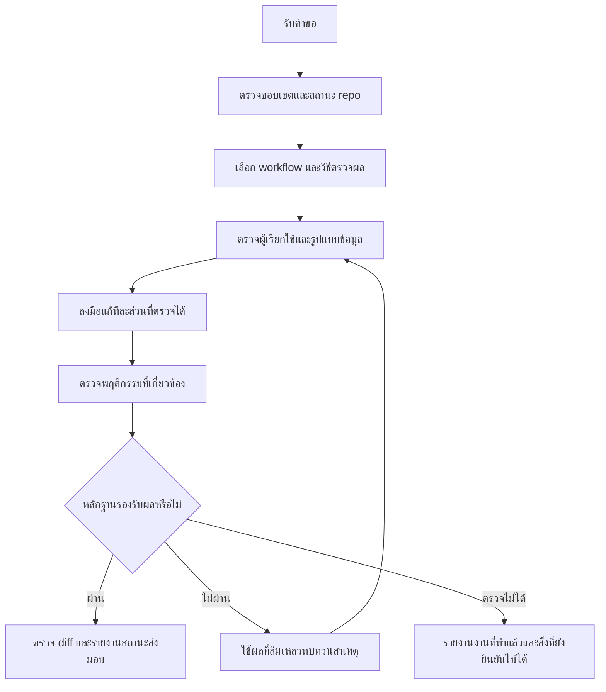

# Engineering Mode

[English](README.md) | [ภาษาไทย](README.th.md)

Engineering Mode เป็นสกิลที่แนะนำให้ agent ทำงานพัฒนาตามขอบเขต ตั้งแต่เข้าใจผลลัพธ์ที่ต้องการ เลือกขั้นตอนที่เหมาะสม ลงมือแก้ ไปจนถึงเก็บหลักฐานยืนยันผล สกิลนี้เป็นชุดคำสั่งที่ agent อ่านและนำไปใช้ ไม่ใช่โปรแกรมที่รันเองหรือบริการเบื้องหลัง

## โครงสร้างและการออกแบบ

| ไฟล์ | ผู้อ่าน | หน้าที่ |
|---|---|---|
| [SKILL.md](SKILL.md) | Agent | ระบุชื่อและเงื่อนไขการเลือกสกิล กติกาหลัก การเลือก workflow และเกณฑ์จบงาน |
| [references/task-workflows.md](references/task-workflows.md) | Agent | ขั้นตอนเฉพาะประเภทงานที่เลือก |
| [README.md](README.md) / README.th.md | ผู้ใช้และผู้ดูแล | คู่มือใช้งาน อธิบายการออกแบบ ตัวอย่าง และข้อจำกัด |

โปรแกรมที่รองรับสกิลค้นพบชื่อและคำอธิบายจาก `SKILL.md` เมื่อเลือกใช้สกิลแล้ว agent จะอ่านคำสั่งหลักและส่วน workflow ที่เกี่ยวข้อง คู่มือ README มีไว้ให้คนเข้าใจและดูแลสกิล ไม่ใช่ไฟล์ที่ agent ต้องอ่านทุกครั้ง สกิลนี้ไม่มี script ที่รันเอง และไม่ต้องติดตั้งสกิลอื่นเป็น dependency

การแยกไฟล์ช่วยให้คำสั่งที่ agent อ่านไม่ยาวเกินจำเป็น ส่วนคำอธิบายการออกแบบและตัวอย่างสำหรับคนสามารถลงรายละเอียดได้โดยไม่เพิ่มภาระให้ทุกงาน

## เหมาะกับงานแบบไหน

ใช้เมื่อพัฒนาฟีเจอร์ วิเคราะห์บั๊ก refactor โดยคงพฤติกรรมเดิม ย้ายโค้ดหรือข้อมูล ตรวจประสิทธิภาพ ตรวจ UI รีวิว หรือส่งต่องาน งานแก้เล็กน้อยที่ผลกระทบต่ำอาจไม่ต้องใช้ขั้นตอนเต็ม แต่การแก้เงื่อนไขสิทธิ์หรือ query แม้เพียงบรรทัดเดียวยังควรใช้ หากขอแผนอย่างเดียว agent จะจัดทำแผน หากขอคำอธิบายอย่างเดียว agent จะอธิบายตามคำขอ

## วิธีเรียกใช้

หลังติดตั้งและเริ่มเซสชันใหม่ ใน Codex ระบุชื่อสกิลพร้อมงาน:

```text
ใช้ $engineering-mode แก้บั๊กที่กดบันทึกแล้วตัวกรองค้นหาถูกล้าง
```

โปรแกรมที่รองรับ slash command ใช้ได้ในรูปแบบ:

```text
/engineering-mode refactor ตัวแปลงข้อมูล order โดยคง API response เดิม
```

การเลือกใช้สกิลอัตโนมัติขึ้นกับโปรแกรม หากยังเป็นฉบับในเครื่องที่ไม่ได้ติดตั้ง ให้ agent อ่านไฟล์โดยตรง:

```text
อ่าน skills/engineering/engineering-mode/SKILL.md
แล้วใช้ขั้นตอนของสกิลนี้หาสาเหตุที่หน้าค้นหาโหลดช้า
```

path นี้ใช้เมื่อเปิด workspace ของ repo นี้ ถ้าอยู่ที่อื่น ให้ระบุ path จริง การติดตั้งฉบับที่เผยแพร่ก่อนเพิ่มสกิลจะไม่ทำให้เห็นไฟล์ที่เพิ่งสร้างในเครื่อง

คำขอที่มีข้อมูลเพียงพอควรบอกผลลัพธ์ที่ต้องการ ขั้นตอนทำซ้ำที่ทราบ ข้อจำกัด และ ticket หรือภาพอ้างอิงถ้ามี หากต้องการ push หรือเปิด MR ให้ระบุด้วย

## ขั้นตอนทำงานโดยรวม



### 1. กำหนดขอบเขตและเกณฑ์สำเร็จ

agent อ่านคำแนะนำของ repo ตรวจไฟล์ที่มีการแก้ค้าง และระบุพฤติกรรมกับ acceptance criteria ที่ต้องทำ ขั้นตอนนี้ช่วยไม่ให้งานใหม่ทับงานอื่น หรือแก้จากข้อกำหนดที่เดาเอง ข้อมูลจากระบบภายนอกที่อาจเปลี่ยนจะถูกตรวจใหม่เมื่อมีผลต่อการตัดสินใจ

ก่อนแก้ต้องเลือกผลที่สังเกตได้ เช่น หลังบันทึกต้องยังเลือกตัวกรองเดิม หรือ API ต้องส่งข้อมูลตามรูปแบบที่กำหนด หากข้อมูลที่ขาดทำให้คำตอบต่างกันจนมีผลต่อความถูกต้องหรือขอบเขต agent จึงถาม โดยทำส่วนที่ไม่ขึ้นกับคำตอบต่อได้

### 2. เลือก workflow ตามงาน

| ประเภทงาน | แนวทาง | หลักฐานหลัก |
|---|---|---|
| บั๊ก | ทำซ้ำและตามเส้นทางข้อมูลจนพบสาเหตุ | อาการก่อนแก้ สาเหตุที่ตรวจพบ และผลทำซ้ำหลังแก้ |
| ฟีเจอร์ | เชื่อมข้อกำหนดกับพฤติกรรมที่สังเกตได้ | ผลตรวจแต่ละเกณฑ์ รวมกรณีสำเร็จและล้มเหลวที่เกี่ยวข้อง |
| Refactor หรือ migration | สำรวจผู้เรียกใช้และสิ่งที่ต้องคงเดิม | ผลเทียบก่อนและหลัง รวมแผนย้ายผู้ใช้ของ API เดิม |
| ประสิทธิภาพ | วัดก่อนแก้แล้วหาจุดที่เป็นคอขวด | ค่าก่อนและหลังภายใต้ workload เดียวกัน |
| UI | ทำซ้ำสถานะที่เห็นและ interaction | ผลตรวจจาก browser หรือโปรแกรมที่ใช้จริง |
| รีวิวหรือส่งต่องาน | ตรวจ diff และสถานะ artifact ล่าสุด | ข้อค้นพบที่มีหลักฐานและสถานะงานปัจจุบัน |

งานที่มีหลายลักษณะใช้เป้าหมายหลักเป็น workflow แล้วเพิ่มการตรวจส่วนอื่นที่ได้รับผลกระทบ เช่น ฟีเจอร์บน UI ต้องตรวจทั้งข้อกำหนดและหน้าจอ แต่ไม่จำเป็นต้องทำ benchmark ถ้างานไม่ได้เกี่ยวกับประสิทธิภาพ

### 3. เข้าใจระบบก่อนเลือกวิธีแก้

agent ตรวจว่าใครเรียกใช้โค้ด ใครเป็นเจ้าของข้อมูล ข้อมูลจริงมาจากไหน และมีข้อตกลงกับระบบภายนอกอย่างไร หากพฤติกรรมใหม่เปลี่ยนรูปแบบข้อมูล ต้องปรับ type และ API contract ที่เกี่ยวข้องให้สอดคล้องกัน ส่วนการตรวจข้อมูลที่ไม่เชื่อถือควรอยู่ตรงจุดรับข้อมูลเข้าสู่ระบบ

การลงมือแบ่งเป็นส่วนที่ทำเสร็จและตรวจได้ หากต้องแก้ซ้ำจำนวนมาก script หรือ codemod อาจช่วยลดความผิดพลาดและทำซ้ำได้ แต่การแก้ธรรมดาไม่ต้องสร้างเครื่องมือใหม่เสมอไป การลบเส้นทางเดิมต้องตรวจผู้เรียกใช้ก่อน และรักษา compatibility เมื่อ rollout หรือระบบภายนอกยังจำเป็นต้องใช้

### 4. ตรวจผลและใช้ความล้มเหลวปรับการวิเคราะห์

การตรวจต้องรองรับผลที่ผู้ใช้เห็นจริง Type check บอกว่าชนิดข้อมูลเข้ากันได้ แต่ไม่ยืนยันว่าหน้าจอทำงานถูกหรือ migration บน production สำเร็จ สำหรับบั๊กที่มีเส้นทางทดสอบอัตโนมัติได้ง่าย workflow ให้เพิ่ม regression test แล้วเห็นว่าล้มเหลวด้วยเหตุที่รายงานก่อนแก้ งานอื่นใช้ test เดิมหรือการทำซ้ำที่บันทึกผลได้ตามความเหมาะสม

หากตรวจไม่ผ่าน agent ใช้หลักฐานนั้นปรับสมมติฐาน ถ้าแก้หลายครั้งแล้วยังล้มเหลวแบบเดิม ต้องกลับไปทบทวนข้อสมมติร่วม หากขาด environment หรือ credential ต้องบอกว่าพฤติกรรมใดยังยืนยันไม่ได้ งานเขียนข้อมูลไปภายนอกที่ timeout ต้องอ่านสถานะปัจจุบันก่อนลองใหม่ เพื่อไม่สร้างข้อมูลซ้ำ

### 5. ตรวจ diff และส่งมอบ

ผลส่งมอบควรบอกว่าเปลี่ยนอะไร ตรวจอะไรแล้ว และเหลือข้อจำกัดอะไร โดยแยกผลผ่าน ล้มเหลว ข้าม และติดข้อจำกัดเมื่อมี สถานะไฟล์ในเครื่อง commit push PR/MR CI merge และ deployment เป็นคนละสถานะ ต้องรายงานตามที่เกิดขึ้นจริง

การเรียกสกิลไม่อนุญาตทุกขั้นตอนส่งมอบโดยอัตโนมัติ คำขอของผู้ใช้เป็นตัวกำหนดสิทธิ์ หากขอให้เปิด MR แล้ว agent ทำต่อในขอบเขตนั้นได้โดยไม่ถามซ้ำ แต่คำขอให้แก้โค้ดอย่างเดียวไม่หมายถึงให้เปิด MR ด้วย

## ตัวอย่าง: บันทึกแล้วตัวกรองหาย

คำขอ: “แก้การบันทึก order ให้ยังเลือกตัวกรองค้นหาเดิม เก็บการแก้ไว้ในเครื่องก่อน”

1. ตรวจงานที่แก้ค้าง จุดเก็บสถานะตัวกรอง save handler และขั้นตอน refresh หลังบันทึก
2. เลือกตัวกรองแล้วบันทึก order เพื่อทำซ้ำอาการตัวกรองถูกล้าง
3. ตามหาว่าการอัปเดตใดล้างค่า หากทดสอบอัตโนมัติได้ง่าย เพิ่ม test ที่ล้มเหลวจากสาเหตุนั้น
4. แก้จุดที่รับผิดชอบ แล้วทำซ้ำ flow เดิม รวมกรณีบันทึกล้มเหลวถ้ามีผลต่อสถานะเดียวกัน
5. รายงานผลตรวจจริง หากยังไม่ได้ตรวจด้วย browser ต้องระบุไว้ และเก็บงานไว้ในเครื่องตามคำขอ

ตัวอย่างนี้ใช้อธิบายขั้นตอน ไม่ใช่ผลทดสอบที่เคยรันกับสกิล

## เครื่องมือและสกิลที่ใช้ร่วมกัน

สกิลเลือกเครื่องมือตามความสามารถที่มีจริง ไม่กำหนดชื่อ connector ตายตัว หากติดตั้งสกิลเฉพาะทาง สามารถใช้ `git-flow` หรือ `react-hook-form-zod` ตามงาน ส่วน `jira-plan`, `glab-mr` และ `glab-mr-review` ตั้ง `disable-model-invocation` ต้องให้ผู้ใช้เรียกเอง สกิลนี้จึงแนะนำตัวที่เหมาะสมแทนการเรียกเอง แต่ถ้าผู้ใช้เรียกสกิลเหล่านี้ร่วมกับ `engineering-mode` แล้ว agent จะอ่านและทำตามทั้งสองสกิล ถ้าไม่มี ให้ทำตามคำแนะนำของ repo ด้วยเครื่องมือที่รองรับ ตรวจ remote host ก่อนเลือกคำสั่ง GitHub หรือ GitLab

ใช้โมเดลปัจจุบัน ไม่จำเป็นต้องมีคณะรีวิวหลายโมเดล การแบ่งงานให้ agent อื่นขึ้นกับสิทธิ์และเครื่องมือที่มี สกิลไม่สร้าง automation เบื้องหลังและไม่เปิดโหมดถาวรข้ามงานด้วยตัวเอง

## ความสัมพันธ์กับ pstack

สกิลนี้เขียนขึ้นใหม่โดยประยุกต์แนวคิดจาก [README ของ pstack ที่ revision อ้างอิง](https://github.com/cursor/plugins/blob/c47b12849e43f18d5c374c7069c744cc55b0ea00/pstack/README.md) ยังไม่ใช่การนำ pstack มาทั้งชุด ไม่มีสกิลย่อยและหลักการทั้งหมดของ pstack ระบบตั้งค่าโมเดล การจัดการ stacked PR ระบบทำงานอัตโนมัติเต็มรูปแบบ หรือชุด automation ของต้นฉบับ

## การตรวจสอบและดูแลเอกสาร

รันจาก root ของ repo:

```bash
python3 tests/validate_skills.py
git diff --check
```

ตัวตรวจสอบครอบคลุม metadata ลิงก์ไฟล์ code fence และรายชื่อสกิลใน README หลัก ส่วนกรณีตรวจขั้นตอนอยู่ใน `tests/skill-workflows.md` และบันทึกผลอยู่ใน `tests/validation-results.md` ผลเหล่านี้ยังไม่พิสูจน์ว่า agent จริงจะทำตามคำสั่งได้ทุกกรณี การเปลี่ยนแปลงนี้ยังไม่มีการทดสอบกับ agent จริงหรือทดสอบโหลดสกิลหลังติดตั้ง

เมื่อเปลี่ยน workflow ให้แก้คำสั่งใน `SKILL.md` หรือไฟล์อ้างอิงก่อน แล้วอัปเดตคู่มือทั้งสองภาษาให้ตรงกัน ตัวอย่างในคู่มือไม่ได้เพิ่มสิทธิ์หรือข้อบังคับในการทำงาน
